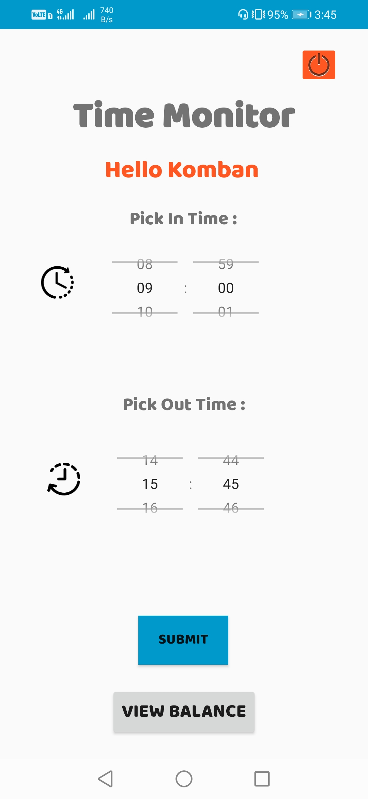
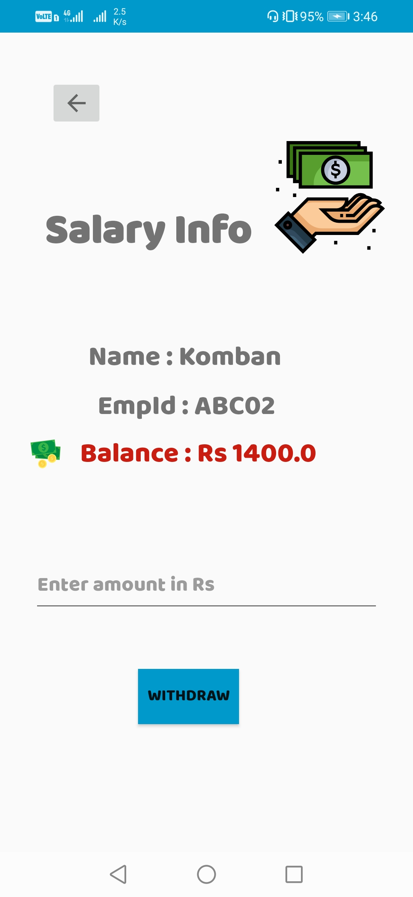

# InOut Salary Calculator App

A Simple native android application which enable an employee of an 
organization 
- To signup and calculate their salary based on the In time and
  Out time chosen by the employee.
- It keeps account of the salary of the employee.
- The employees can withdraw from their salary balance. 
   

## Getting Started

You can download the Android app by clicking the link below.  

- [Download: Click-here](https://drive.google.com/file/d/1YFn8FPrzE5Vj7M8AtcXzLez3744K347-/view?usp=sharing) to download the app.

## Overview 

#### Login    

#### SignUp 

#### Dashboard

#### Salary

