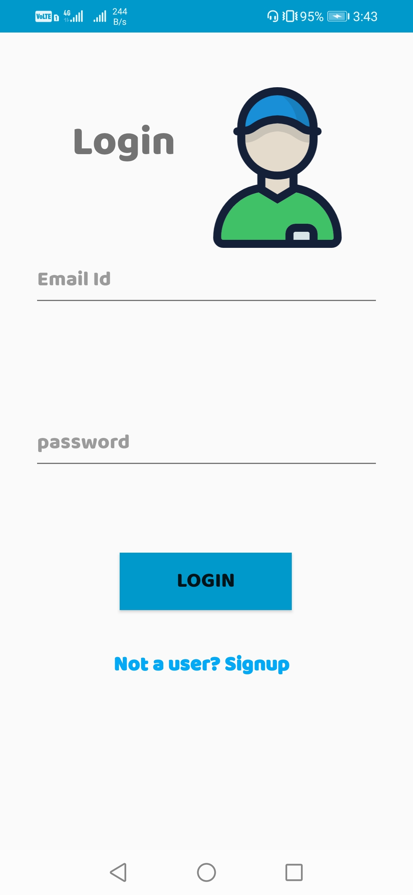
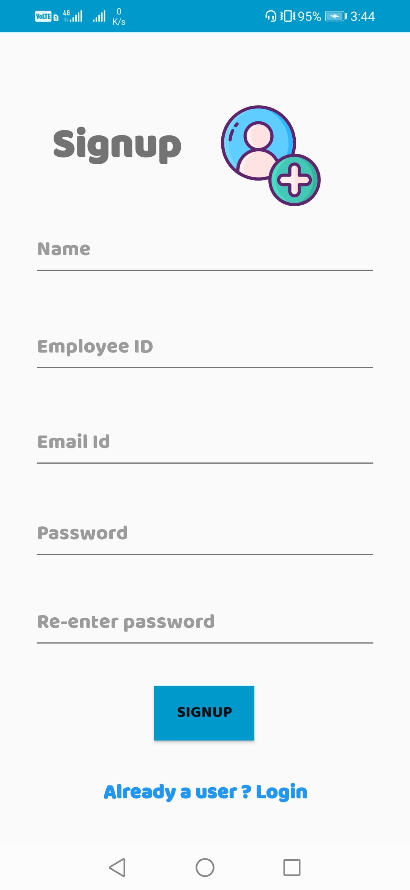

# InOut Salary Calculator App

A Simple native android application which enables an employee of an 
organization 
- To signup and calculate their salary based on the In time and
  Out time chosen by the employee.
- It keeps account of the salary of the employee.
- The employees can withdraw from their salary balance. 
   

## Getting Started

You can download the Android app by clicking the link below.  

- [Click-here](https://github.com/LoneDevs/FasTrack-InOut/releases/tag/1.0.1) to download the app.

## Overview 

#### Login    

#### SignUp 

#### Dashboard

#### Salary

